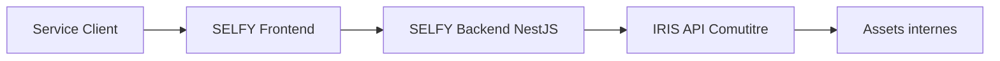
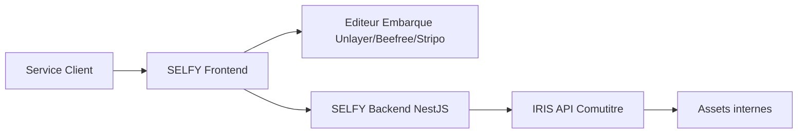
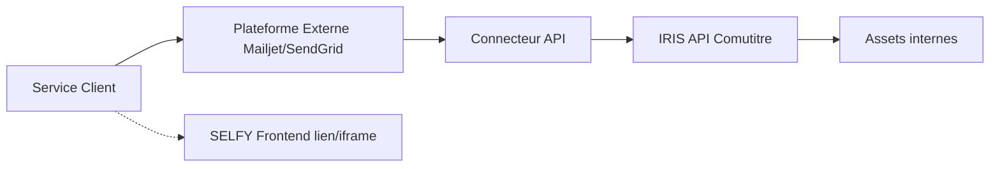
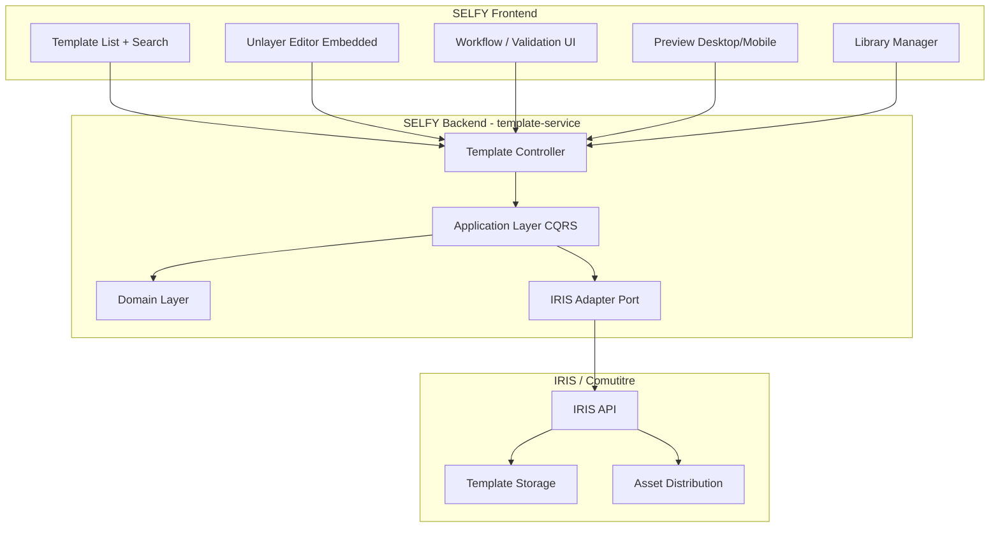

# Etude et Inventaire - Outils de Gestion de Templates Mails

---

## 1. Etat des lieux SELFY Backend

L'architecture actuelle de SELFY est un monorepo NestJS avec microservices (user-service, document-service, database-service) suivant DDD + Clean Architecture + CQRS. Les integrations AWS existantes sont : **Cognito** (auth), **S3** (stockage), **SQS** (messaging). Un `HttpModule` (Axios) est deja configure dans l'infrastructure layer ([infrastructure.module.ts](apps/user-service/src/infrastructure/infrastructure.module.ts)).

**Points cles :**

- Aucune integration email template existante
- Aucune connexion a IRIS / brique Comutitre
- Pas d'AWS SES configure
- Le pattern ports & adapters permettrait d'ajouter un adapter IRIS sans impacter les couches domain/application

---

## 2. Synthese des Besoins SC (extraits des images)

| Categorie | Besoins cles |

|---|---|

| **Gestion des evenements** | Associer template a evenement metier, tags, planification (J+1, J+4...), priorites/conditions, equivalence courrier/email |

| **Gouvernance** | Habilitations/roles, workflow (brouillon, relecture, valide, publie), commentaires, versioning + rollback, archivage, statuts |

| **Monitoring** | Suivi envois (volume, bounces), alertes (template KO, erreurs, volume suspicieux) |

| **Experience utilisateur** | Recherche + filtres (IA), duplication, consultation, export, comparaison entre templates |

| **Bibliotheque** | Header/footer, signature, adresse expeditrice, tags, snippets, liens, images/videos, documents, variables, zones variables |

| **Creation templates** | Reference, description, objet, contenu (avec elements bibliotheque), mise en forme, correcteur, PJ, zones conditionnelles |

| **Preview et deploiement** | Preview temps reel (desktop/mobile), envoi test, programmation MEP, gestion dependances bibliotheque/templates |

---

## 3. Inventaire des Solutions du Marche

### 3.1 Plateformes Externes Completes (Solution Externe)

| Solution | Type | Editeur visuel | API Template | Gestion workflow | Collaboration | Pricing |

|---|---|---|---|---|---|---|

| **AWS SES** | Infrastructure email AWS | Non (console technique) | Oui (20k templates/region, 500KB max) | Non | Non | Pay-per-use (~0.10$/1000 emails) |

| **Mailjet** (Sinch) | Plateforme emailing | Oui (drag-and-drop) | Oui (REST API) | Partiel | Oui (temps reel, permissions) | Freemium, plans des 15EUR/mois |

| **SendGrid** (Twilio) | Plateforme transactionnel | Oui (drag-and-drop) | Oui (REST API) | Partiel | Limite | Freemium, plans des 19.95$/mois |

| **Brevo** (ex-Sendinblue) | Plateforme marketing | Oui (drag-and-drop) | Oui (REST API) | Partiel | Oui | Freemium, plans des 25EUR/mois |

### 3.2 Editeurs Embeddables (Solution Hybride)

| Solution | Integration | Drag-and-drop | Custom blocks | Export HTML | White-label | Pricing |

|---|---|---|---|---|---|---|

| **Unlayer** | React component (`react-email-editor`), JS SDK | Oui | Oui | Oui | Payant | Free (open-source) + plans payants |

| **Beefree SDK** (BEE) | JS SDK embeddable | Oui | Oui | Oui | Oui | Payant (sur devis) |

| **Stripo Plugin** | JS SDK embeddable | Oui | Oui | Oui | Oui | Payant (sur devis) |

| **MJML** (Mailjet) | Framework open-source | Non (code) | Oui | Oui | N/A | Gratuit (open-source) |

### 3.3 Frameworks Techniques (pour dev custom)

| Solution | Type | Avantage | Inconvenient |

|---|---|---|---|

| **React Email** | Composants React pour emails | Moderne, TypeScript | Pas de WYSIWYG, dev uniquement |

| **MJML** | Framework email responsive | Standard industriel, open-source | Pas d'editeur visuel pour SC |

| **Handlebars / Nunjucks** | Moteurs de templating | Flexible, variables dynamiques | Technique, pas pour SC |

---

## 4. Comparatif des Trois Scenarios

### Scenario A : Solution Comutitre (Full SELFY)

**Description :** Developpement complet d'un front-end dans SELFY. Le backend SELFY sert de proxy/orchestrateur vers IRIS. Toute la logique metier est portee par IRIS + Comutitre.

| Critere | Evaluation |

|---|---|

| **Avantages** | Controle total UI/UX, integration native avec SELFY (auth, roles, audit), coherence avec l'existant, pas de dependance externe, donnees hebergees en interne |

| **Limites** | Charge de dev tres importante (editeur WYSIWYG, preview, gestion bibliotheque), time-to-market long, maintenance de l'editeur email a assumer, complexite de la gestion du rendu HTML responsive |

| **Impact SELFY** | Fort : nouveau module complet (template-service), nouveau FE |

| **Impact IRIS** | Moyen : IRIS expose ses APIs, SELFY consomme |

| **Prerequis** | API IRIS documentee et stable, equipe front suffisante, expertise email HTML |

| **Adherence besoins SC** | Elevee si bien execute, mais risque de livraison partielle |

| **Macro-chiffrage** | 4-6 mois (editeur + workflow + bibliotheque + preview + integration IRIS) |

### Scenario B : Solution Hybride

**Description :** Embarquer un editeur email tiers (Unlayer, Beefree SDK, ou Stripo Plugin) dans le front SELFY. Le reste de l'UI (listing, workflow, versioning, bibliotheque) est developpe dans SELFY. Le backend orchestre la persistance via IRIS.

| Critere | Evaluation |

|---|---|

| **Avantages** | Editeur drag-and-drop professionnel sans le developper, UX de qualite pour le SC, integration dans SELFY (auth, roles), gain de temps significatif sur la partie editeur, export HTML standardise |

| **Limites** | Cout de licence editeur tiers, dependance a un fournisseur pour l'editeur, customisation limitee aux capacites du SDK, necessaire de developper les couches workflow/versioning/bibliotheque |

| **Impact SELFY** | Moyen-Fort : nouveau module mais editeur delegue |

| **Impact IRIS** | Moyen : meme pattern d'API |

| **Prerequis** | API IRIS documentee, licence editeur, evaluation POC de l'editeur choisi |

| **Adherence besoins SC** | Elevee : editeur pro + UI SELFY pour le workflow |

| **Macro-chiffrage** | 2-3 mois (integration editeur + workflow + bibliotheque + integration IRIS) |

**Candidats editeurs embarquables :**

- **Unlayer** (recommande) : composant React open-source + plans payants, large communaute, custom blocks, merge tags pour variables
- **Beefree SDK** : editeur mature, white-label, mais payant sur devis
- **Stripo Plugin** : editeur riche, white-label, payant sur devis

### Scenario C : Solution Externe

**Description :** Utiliser une plateforme externe (Mailjet, SendGrid, Brevo) pour toute la gestion des templates. L'outil externe est connecte a IRIS via API/webhook. SELFY redirige ou embarque (iframe) l'outil externe.

| Critere | Evaluation |

|---|---|

| **Avantages** | Solution cle en main, time-to-market rapide, editeur professionnel inclus, monitoring/analytics inclus, pas de maintenance FE |

| **Limites** | Donnees templates chez un tiers (enjeu securite/conformite), integration IRIS complexe (connecteur custom), UX non integree a SELFY (rupture de navigation), gestion des droits dupliquee (SELFY + outil externe), cout recurrent licence, dependance forte a un fournisseur |

| **Impact SELFY** | Faible : simple redirection/lien |

| **Impact IRIS** | Fort : necessaire de developper un connecteur IRIS <-> outil externe |

| **Prerequis** | Validation securite/RGPD (donnees chez un tiers), API IRIS compatible, connecteur custom a developper |

| **Adherence besoins SC** | Moyenne : fonctionnalites riches mais manque de coherence avec SELFY, workflow valide/publie potentiellement partiel, versioning/rollback non garanti |

| **Macro-chiffrage** | 1-2 mois (connecteur IRIS + configuration plateforme + mise en place acces) |

---

## 5. Matrice de Synthese

| Critere | Poids | A. Full SELFY | B. Hybride | C. Externe |

|---|---|---|---|---|

| Coherence UX avec SELFY | Eleve | +++  | ++ | - |

| Autonomie SC | Eleve | ++ | +++ | ++ |

| Couverture fonctionnelle | Eleve | ++ | +++ | ++ |

| Time-to-market | Eleve | - | ++ | +++ |

| Cout de dev | Moyen | - | + | ++ |

| Cout recurrent | Moyen | +++ | + | - |

| Securite / souverainete | Eleve | +++ | ++ | - |

| Integration IRIS | Eleve | ++ | ++ | + |

| Maintenance long terme | Moyen | - | + | ++ |

| Evolutivite | Moyen | ++ | ++ | + |

---

## 6. Recommandation

La **Solution B (Hybride)** avec un editeur embarque de type **Unlayer** (ou Beefree SDK) represente le meilleur compromis :

1. **L'editeur drag-and-drop** est le composant le plus complexe et le plus couteux a developper from scratch. Le deleguer a un outil specialise divise la charge par 2.
2. **Les couches metier** (workflow, versioning, bibliotheque, gouvernance) restent dans SELFY et se connectent naturellement a IRIS via le pattern ports & adapters deja en place.
3. **La coherence UX** est preservee car l'editeur est embarque dans SELFY, contrairement a une solution full externe.
4. **La securite** est maitrisee : les templates sont stockes via IRIS/Comutitre, seul le composant d'edition visuelle est tiers.

### Architecture cible recommandee

### Prochaines etapes si la recommandation hybride est validee

1. POC d'integration Unlayer / Beefree dans un prototype SELFY FE
2. Documentation et validation de l'API IRIS (contrats, endpoints, auth)
3. Design du domain model `template-service` dans le backend SELFY
4. Cadrage detaille du lot (US, chiffrage fin
