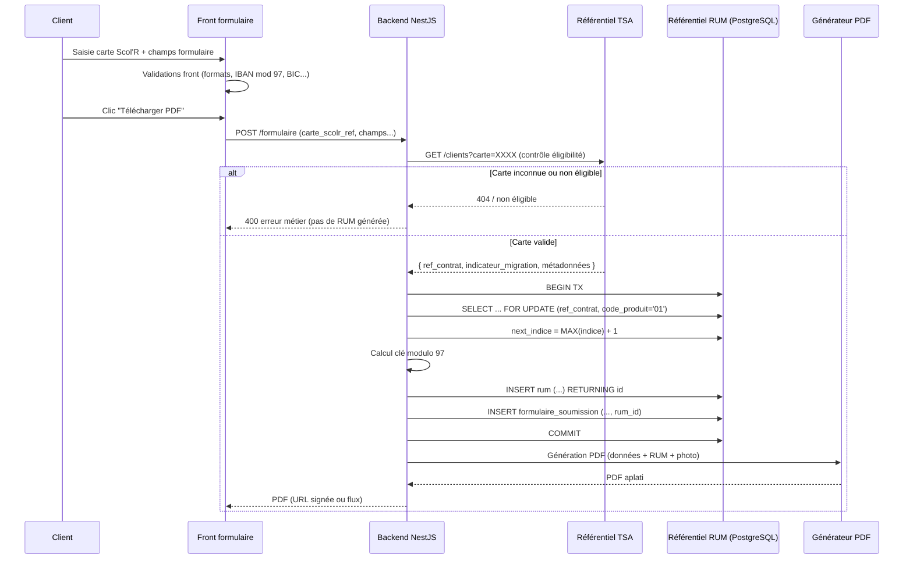
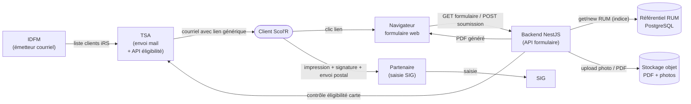

# Étude & macro-chiffrage – Formulaire hybride IRS Scol'R

Document d'étude préalable présentant deux scénarios cibles pour la mise en place d'un formulaire hybride permettant aux personnes éligibles de souscrire à l'abonnement **IRS Scol'R**. Le formulaire est dit « hybride » : le client le complète depuis son ordinateur, puis l'imprime pour la signature manuscrite, la photo et le RIB, avant envoi postal au partenaire pour saisie dans le SIG.

- **Auteur** : équipe FABRIQUE – Comutitres
- **Statut** : étude / macro-chiffrage
- **Échéance de retour** : 15 avril
- **Périmètre** : solutions 1 et 2 décrites dans les diagrammes de séquence

### Positionnement de l'étude

Ce document constitue un **macro-chiffrage Build Fabrique** et **non un engagement de delivery exhaustif**. Il a vocation à éclairer le comité de pilotage sur les ordres de grandeur, les dépendances et les risques des deux scénarios proposés.

Un **affinage** du chiffrage, du planning et du périmètre sera réalisé après :
- cadrage détaillé métier et fonctionnel ;
- validation des dépendances externes (TSA, DataFactory, Sarbacane selon scénario) ;
- levée des questions ouvertes bloquantes listées au §8 ;
- obtention des prérequis Go/No-Go listés au §9.

Les choix d'infrastructure mentionnés dans l'étude (stockage objet, gestionnaire de secrets, orchestrateur de déploiement, chiffrement au repos, etc.) sont présentés en termes **génériques** et devront être **confirmés en cadrage** en fonction de l'écosystème cible SELFY / Comutitres.

---

## 1. Contexte et objectif

### 1.1 Contexte métier

À la suite du point avec La Fabrique, Jean-Philippe a proposé deux options pour la gestion du formulaire hybride IRS Scol'R. L'équipe La Fabrique doit remonter une estimation de chiffrage.

- **Scénario 1** : génération de la RUM au moment de la génération du formulaire PDF pour impression.
  - TSA prend en charge l'envoi du mail aux clients Scol'R.
  - Un référentiel doit être créé pour assurer la génération de la RUM avec le numéro du formulaire.
- **Scénario 2** : génération de la RUM via un token présent dans le lien du formulaire envoyé par mail.
  - Comutitres doit envoyer le mail aux clients Scol'R (processus TSA → Comutitres à définir pour la transmission des adresses e‑mail).
  - Un référentiel RUM doit être créé ainsi qu'une génération de Token avec DataFactory.

### 1.2 Champs demandés au client pour la souscription

- Référence carte Scol'R
- Nom / prénom du payeur et du porteur
- Date de naissance
- Adresse e‑mail du payeur
- Adresse e‑mail du porteur
- Niveau scolaire
- Nom de l'établissement
- Adresse postale de l'établissement
- Photo du porteur
- N° de client du porteur (si déjà existant)
- N° de client du payeur (si déjà existant)
- Mandat SEPA et RUM
- RIB
- Signature (manuscrite après impression)

### 1.3 Règle de construction de la RUM

Le n° de RUM est formé de **33 ou 35 caractères** obtenus par concaténation de :

1. **Indicateur de continuité APA en Mandat** :
   - `++` si l'indicateur de mandat SEPA migré est à « Oui »
   - vide s'il s'agit de la création d'un nouveau mandat
2. **Code ICS Comutitres** : `FR42ZZZ457385`
3. **Référence du contrat** commercial ou tiers payant sur **14 caractères** :
   - remplacer les `_` éventuels par `-`
   - compléter à gauche par des `0` pour atteindre 14 caractères
4. **Code produit** sur **2 caractères** : `01` (iRS), `02` (iRE), `04` (NVA), `05` (NL+), complété à gauche par `0` si besoin
5. **Indice** sur **2 caractères** : distingue deux mandats sur un même contrat commercial ; commence à `00`, complété à gauche par `0`
6. **Clé de contrôle** sur **2 chiffres** : `97 – modulo97(chaîne_numérique)`
   - Les `++` sont remplacés par `11` pour le calcul
   - L'ICS n'est **pas** pris en compte
   - Les `_` dans la référence du contrat ne sont **pas** considérés

**Exemple** — Contrat Navigo Annuel référence `000987654_3` :
- RUM générée : `++FR42ZZZ457385000000987654-30400yy`
- Chaîne numérique pour le calcul de `yy` : `1100000098765430400`
- `yy = 97 – modulo97(1100000098765430400) = 97 – 69 = 28`
- RUM finale : `++FR42ZZZ457385000000987654-3040028`

---

## 2. Périmètre commun aux deux solutions

Quel que soit le scénario retenu, les composants suivants sont à livrer. Le chiffrage s'appuie sur une **forte réutilisation du socle SELFY existant** (NestJS, PostgreSQL, libs `logger` FE1382, `config`, `utils`, `auth`, `swagger`, `bootstrap`, pipelines CI/CD GitLab, déploiement Docker).

### 2.1 Formulaire web (front)

- Page publique (hors authentification BO) responsive, accessible via un lien spécifique.
- **Stack front** : frontend web adossé au **standard de développement front Comutitres** (actuellement **Next.js sur SELFY**), à confirmer en cadrage.
- Validation front (champs obligatoires, formats, retour d'erreur instantané).
- Upload photo du porteur (format, poids, preview) — **règle métier à confirmer** (cf. §8 questions ouvertes).
- Contrôle bancaire :
  - **IBAN** : validation de format (structure pays + longueur) + contrôle de la **clé modulo 97**.
  - **BIC** : validation du **format et de la structure** (8 ou 11 caractères, alphanumérique, codes pays / banque / localité).
- Accessibilité RGAA : **audit externe hors périmètre Build Fabrique** ; bonnes pratiques appliquées dans le code.
- Internationalisation : structure FR uniquement en V1.

### 2.2 Back-office / API (NestJS – socle SELFY)

- Endpoints d'affichage du formulaire (GET) et de soumission (POST).
- Endpoint de génération du PDF (template pré-rempli + photo + RUM).
- **Référentiel RUM** (PostgreSQL) – structure commune : `id`, `rum`, `indice`, `code_produit`, `ref_contrat`, `ics`, `cle_modulo97`, `indicateur_migration`, `client_ref`, `status`, `token` (scénario 2 uniquement), `created_at`, `used_at`.
- Implémentation de l'algorithme RUM (section 1.3) comme **service métier dédié** : transaction PostgreSQL, verrou logique sur l'indice, historique, tests unitaires exhaustifs, tests de concurrence.
- Contrainte d'unicité `(ref_contrat, code_produit, indice)` + verrou transactionnel.
- Stockage du formulaire soumis + horodatage + statut (brouillon / validé / PDF généré).
- Anti-abus : rate limiting, CAPTCHA, protection anti-replay.
- **PDF non modifiable** après génération (aplatissement des champs, pas d'interactivité résiduelle).
- Hébergement applicatif : **orchestrateur cible à confirmer en cadrage** (cohérent avec la cible d'hébergement SELFY / Comutitres).
- Chiffrement au repos : selon **standard d'hébergement** de la plateforme cible.
- Gestion des secrets : **gestionnaire de secrets de la plateforme cible** (à confirmer en cadrage).
- Observabilité : logs au format **FE1382 via la lib `logger` SELFY** (Winston), corrélation `correlation_id` / `request_id`.

### 2.3 Génération PDF

- Template PDF avec zones pré-remplies + photo + RUM.
- Librairie à arbitrer (pdfkit, puppeteer…). Hypothèse de chiffrage : **template fourni par le métier** ; sinon rallonger le lot PDF.
- Archivage du PDF : **stockage objet de la plateforme cible** (type S3 ou équivalent, à confirmer en cadrage), avec URL signée à durée limitée.
- **Archivage légal mandats SEPA** à cadrer avec le DPO (durée de conservation réglementaire) — point listé, **mise en œuvre hors périmètre Build Fabrique**.

### 2.4 Socle transverse réutilisé depuis SELFY

- Documentation OpenAPI (lib `swagger` SELFY).
- Tests unitaires (l'algorithme RUM est critique) + intégration sur cas de concurrence.
- Observabilité (logs FE1382, métriques, alertes Datadog – cohérent avec le plan `docs/plan/plan-logging-unifie-tickets.md`).
- CI/CD (pipeline GitLab, Docker, déploiement cible) – patterns existants SELFY.

### 2.5 Éléments explicitement exclus du périmètre Build Fabrique

Ces items sont identifiés mais **non chiffrés** dans cette étude. Ils restent à porter par d'autres acteurs ou à chiffrer à part.

- Audit RGAA externe complet.
- DPIA RGPD et conformité (DPO).
- Recette métier IDFM / TSA (UAT élargie).
- Conduite du changement, formation utilisateurs.
- Support post go-live et MCO.
- Homologation sécurité transverse.
- Définition / négociation du processus d'échange inter-équipes (TSA → Comutitres en S2).
- Contractualisation Sarbacane (en S2).

---

## 3. Spécificités Solution 1 — Envoi mail par TSA, RUM à la génération PDF

### 3.1 Flux fonctionnel

1. IDFM envoie au client un courriel Tarif iRS (via TSA).
2. Le client clique sur le lien et le formulaire s'affiche.
3. Le client complète le formulaire — contrôle des champs obligatoires.
4. Au clic **« Télécharger PDF »** :
   - le BO interroge le référentiel RUM (nouvel indice pour le contrat),
   - génère la RUM,
   - produit le PDF,
   - retourne le PDF au client.
5. Le client imprime, signe, et envoie le formulaire papier par voie postale au partenaire.
6. Le partenaire réceptionne et saisit les informations dans le SIG.

### 3.2 Impacts techniques

- **Lien générique** : pas de personnalisation client → le formulaire est exposé publiquement, le client saisit lui-même sa référence carte Scol'R.
- **Sécurité : condition de viabilité** — la Solution 1 n'est viable de manière sécurisée **que si un contrôle serveur de l'éligibilité existe** (cf. §3.3 et §9 Go/No-Go). Sans ce contrôle, le formulaire public peut générer des RUM à tort. **Point de gouvernance majeur**.
- **Dépendance TSA** : envoi mail géré côté TSA (aucun dev côté Comutitres sur cette brique).
- **Référentiel RUM** alimenté au runtime (à la volée), sans pré-génération.

### 3.3 Mécanisme de liaison client ↔ RUM

L'algorithme RUM exige la **référence du contrat commercial (14 c.)** et **l'indicateur de migration SEPA**. Or, la liste des champs saisis par le client (§1.2) contient la **référence carte Scol'R**, **pas** la référence du contrat commercial ni l'indicateur de migration. Il faut donc un mécanisme de résolution côté BO.

#### 3.3.1 Trois options possibles

**Option A — Résolution serveur via API TSA (recommandée)**
Le client saisit sa référence carte Scol'R. Le BO appelle une API TSA au moment de la soumission pour obtenir `{ référence contrat, indicateur migration, éventuellement métadonnées de pré-contrôle }`, puis construit la RUM.

- **Avantages** : fraîcheur de la donnée, pas de référentiel local à entretenir, contrôle d'éligibilité en temps réel.
- **Inconvénients** : dépendance à la disponibilité et au SLA d'une API TSA.
- **Prérequis bloquant** : TSA doit exposer cette API.

**Option B — Référentiel Scol'R importé en local**
TSA pousse périodiquement (SFTP / API batch) un extrait listant, pour chaque carte Scol'R, la référence du contrat et l'indicateur de migration. Le BO héberge une table locale `referentiel_scolr` consultée à la soumission.

- **Avantages** : autonomie vis-à-vis de TSA en lecture, meilleure disponibilité.
- **Inconvénients** : fraîcheur (délai entre modification TSA et mise à jour locale), gestion du pipeline d'ingestion, conformité RGPD sur la copie locale.
- **Prérequis bloquant** : convention de transfert TSA → Comutitres à définir.

**Option C — Lien semi-personnalisé (paramètre d'URL)**
TSA glisse dans le lien un paramètre contenant la référence contrat (ex. `?ref=…`). Le BO lit la référence contrat depuis l'URL.

- **Avantages** : pas de dépendance API TSA au runtime.
- **Inconvénients** : **contredit la description « lien générique »** des diagrammes source, expose la référence contrat en clair dans le mail, brouille le positionnement entre S1 et S2 (quasi-token sans sa sécurité).
- **Non retenue** sauf décision explicite du comité.

#### 3.3.2 Option retenue pour l'étude : Option A

L'étude chiffre la Solution 1 sur la base de l'**Option A** (résolution via API TSA), qui est la plus cohérente avec la description fonctionnelle (lien générique, envoi mail par TSA) et la moins invasive côté Comutitres. L'**Option B** reste un repli acceptable si l'API n'est pas disponible, avec un surcoût de pipeline d'ingestion (~+3 à +5 j/h).

**La disponibilité d'un mécanisme de contrôle serveur (Option A ou B) est un prérequis Go/No-Go de la Solution 1**, cf. §9.

#### 3.3.3 Diagramme de séquence — Liaison client ↔ RUM (Option A)



#### 3.3.4 Matérialisation du lien

Une fois la RUM générée, le lien client ↔ RUM est matérialisé à trois niveaux :

- **En base de données** : clé étrangère `formulaire_soumission.rum_id → rum.id`. Le BO persiste également `ref_contrat` dans `formulaire_soumission` pour audit et réémission.
- **Sur le PDF imprimé** : la RUM, la référence carte Scol'R et l'identité du porteur / payeur sont imprimées sur le document papier.
- **Côté partenaire / SIG** : à réception du dossier papier signé, le partenaire saisit la RUM et les coordonnées dans le SIG ; le BO peut (option) passer `rum.status` de `reserved` à `used` sur retour de confirmation.

#### 3.3.5 Gestion des cas d'erreur

- **Carte Scol'R inconnue ou non éligible** : rejet serveur avant toute consommation de RUM (pas d'INSERT dans `rum`, message d'erreur neutre côté formulaire, log d'audit).
- **Panne TSA (Option A)** : retour d'erreur 503 au client, **aucune RUM consommée**. À doubler d'un monitoring sur la disponibilité TSA.
- **Abandon après génération PDF** : la RUM est marquée `reserved`, puis passera en `used` à confirmation partenaire ou restera non utilisée (comportement métier à valider avec TSA — cf. §8).

### 3.4 Macro-chiffrage Solution 1

Unité : **jours-homme (j/h)**. Fourchette basse / haute par lot. Périmètre **Build Fabrique** (conception technique, dev, tests unitaires et d'intégration, QA technique, pilotage léger). Hors audit RGAA, DPIA, UAT métier, support post go-live.

| # | Lot | Détail | Charge |
|---:|---|---|---:|
| 1 | Cadrage technique & conception | specs techniques, modèle de données, stratégie RUM, ADR léger | 3 – 4 |
| 2 | Frontend formulaire | page, validations, upload photo, UX | 4 – 6 |
| 3 | Backend NestJS (endpoints + persistance) | GET/POST formulaire, persistance PostgreSQL, réutilisation libs SELFY (`config`, `utils`, `swagger`, `logger`) | 5 – 7 |
| 4 | Service RUM (algo + transaction + tests) | modulo 97, verrou Postgres, historique, tests unitaires + concurrence | 4 – 6 |
| 5 | Génération PDF | template, fusion données + photo + RUM, aplatissement | 3 – 5 |
| 6 | Sécurité minimale (CAPTCHA, rate-limit, anti-bot, contrôle réf. Scol'R) | protections formulaire public | 2 – 3 |
| 7 | QA technique & tests d'intégration | scénarios bout en bout Fabrique, cas de bord RUM, cas PDF | 3 – 5 |
| 8 | Pilotage & coordination | synchros, ajustements, support recette Fabrique | 2 – 3 |
| | **Total brut** |  | **26 – 39** |
| | **Marge 15 – 20 %** (incertitudes cadrage / intégration) |  | **+4 – +8** |
| | **Total macro retenu** |  | **30 – 47 j/h** |

**Hypothèses d'efficacité mobilisées** :
- réutilisation du socle SELFY (NestJS, logger FE1382, config, validators, swagger, CI/CD, Docker) ;
- volume cible ≤ 100 utilisateurs → pas d'infra dimensionnée ni de tests de charge lourds ;
- iRS uniquement en V1 → un seul code produit (`01`) à gérer dans l'algorithme RUM ;
- template PDF fourni par le métier.

---

## 4. Spécificités Solution 2 — Envoi mail par Comutitres via DataFactory + Sarbacane

### 4.1 Flux fonctionnel

1. IDFM envoie à **DataFactory** la liste des courriels clients Tarif iRS.
2. DataFactory :
   - récupère la liste des courriels client,
   - **génère la RUM par client** (pré-génération),
   - crée un **token** associé à la RUM,
   - construit la liste `courriel + lien + token`,
   - envoie la liste de diffusion à **Sarbacane**.
3. Sarbacane envoie les courriels individualisés au client (lien + token).
4. Le client clique sur le lien tokenisé → affichage du formulaire (RUM liée au token).
5. Le client complète, contrôle des champs obligatoires.
6. Génération PDF directe (la RUM est déjà connue, pas d'appel au référentiel au moment du téléchargement).
7. Le client imprime, signe, envoie le formulaire papier par voie postale.
8. Partenaire réceptionne et saisit dans le SIG.

### 4.2 Impacts techniques

- **DataFactory** : pipeline à industrialiser (job batch, ordonnancement, reprise sur erreur, idempotence). Outil existant côté Comutitres — **côté Fabrique, seule l'exposition de l'API RUM et le format d'échange sont chiffrés**.
- **Sarbacane** : routeur mail SaaS. Côté Fabrique, périmètre chiffré = intégration applicative de l'envoi de liste (API / export) ; **contractualisation et délivrabilité hors périmètre**.
- **Token** : recommandation **token opaque aléatoire** persisté en base PostgreSQL (expiration, usage unique, statut `active / used / revoked`). Choix plus sobre qu'un JWT pour un faible volume et un besoin simple ; évite de déporter trop d'information dans l'URL et simplifie la révocation.
- **Processus métier TSA → Comutitres** : à définir (fréquence, format d'échange SFTP / API, consentement RGPD) — **cadrage hors périmètre Fabrique**, seule l'interface technique d'ingestion est chiffrée.
- **Double référentiel** : table RUM + table token.
- **Sécurité renforcée** : lien personnalisé = risque en cas de divulgation → expiration obligatoire, non-réutilisation (anti-rejeu), protection brute-force.
- **UX** : pas de saisie manuelle de la référence carte Scol'R → parcours fluide, moins d'erreurs.

### 4.3 Macro-chiffrage Solution 2

Unité : **jours-homme (j/h)**. Fourchette basse / haute par lot. Périmètre **Build Fabrique**.

| # | Lot | Détail | Charge |
|---:|---|---|---:|
| 1 | Cadrage technique & conception | specs, modèle de données, stratégie RUM + token, interface DataFactory | 4 – 5 |
| 2 | Frontend formulaire | page, lecture / passage du token, validations, UX | 5 – 7 |
| 3 | Backend NestJS (endpoints + persistance + validation token) | GET/POST formulaire, consommation token, persistance PostgreSQL | 6 – 8 |
| 4 | Service RUM (algo + transaction + tests) | idem Solution 1 | 4 – 6 |
| 5 | Service Token (génération + stockage + expiration + consommation) | token opaque, table `form_access_token`, statuts | 3 – 5 |
| 6 | Génération PDF | template, fusion données + photo + RUM | 3 – 5 |
| 7 | Préparation campagne & intégration emailing | interface DataFactory / API RUM + API Sarbacane (envoi liste), mapping, gestion erreurs de lot | 5 – 8 |
| 8 | Sécurité & anti-rejeu | statuts token, contrôles anti-réutilisation, rate-limit, audit trail | 3 – 5 |
| 9 | QA technique & tests d'intégration | scénarios bout en bout, cas d'expiration, lien déjà utilisé, régénération, cas de bord RUM | 4 – 6 |
| 10 | Pilotage & coordination | synchros, coordination inter-équipes Fabrique (Sarbacane / DataFactory), support recette | 3 – 4 |
| | **Total brut** |  | **40 – 59** |
| | **Marge 15 – 20 %** (incertitudes cadrage / intégration) |  | **+6 – +12** |
| | **Total macro retenu** |  | **46 – 71 j/h** |

**Hypothèses d'efficacité mobilisées** :
- mêmes hypothèses que Solution 1 (socle SELFY, volume ≤ 100, iRS seul, template PDF fourni) ;
- DataFactory et Sarbacane existent déjà côté Comutitres : seul le **contrat d'interface** (API / formats) est chiffré côté Fabrique ;
- gouvernance inter-équipes (TSA → Comutitres) et contractualisation Sarbacane : **hors périmètre Fabrique**.

---

## 5. Synthèse comparative

| Critère | Solution 1 | Solution 2 |
|---|---|---|
| Complexité technique globale | Faible à modérée | Modérée à forte (DataFactory + Sarbacane + tokens) |
| Nouveaux composants | Référentiel RUM | Référentiel RUM + tokens + interface DataFactory + intégration Sarbacane |
| Charge macro Build Fabrique | **30 – 47 j/h** | **46 – 71 j/h** |
| Coût de run | Faible | Modéré (pipeline batch + emailing à maintenir) |
| Expérience utilisateur | Moyenne (saisie réf. carte par le client) | Meilleure (lien personnalisé, pré-remplissage possible) |
| Sécurité d'accès | Exposition publique → CAPTCHA + **contrôle serveur d'éligibilité obligatoire** | Lien personnalisé + token à durée limitée |
| Traçabilité | Moyenne | Forte (token nominatif + audit trail) |
| Dépendances externes | TSA (envoi mail + **API contrôle éligibilité**) | TSA (liste mail) + Sarbacane + DataFactory |
| Dépendances processus | Faibles | Fortes (nouveau processus TSA → Comutitres) |
| Adaptation ≤ 100 utilisateurs | Très bonne | Bonne (surdimensionnée si volume reste faible) |
| Scalabilité future | Moyenne | Meilleure (industrialisation campagne) |
| Risque projet | Modéré | Plus élevé (intégrations multiples) |

**Note sur les délais** : les time-to-market indiqués au §10.3 correspondent à une **estimation théorique de réalisation Build**, **hors délais d'alignement inter-équipes, validations métier et dépendances externes**. Les délais réels en comité incluront ces marges.

---

## 6. Risques et points de vigilance

### 6.1 Communs

- **Algorithme RUM** : une erreur de calcul modulo 97 entraîne un rejet par l'ACE → batterie de tests dédiée (cas `_` dans la référence, cas `++` migration SEPA, cas `00` à `99` d'indice). En V1 iRS seul, le périmètre de test est réduit (code produit `01`).
- **Unicité de l'indice** par contrat commercial : verrou transactionnel + contrainte `UNIQUE(ref_contrat, code_produit, indice)`.
- **Photo porteur** : format, taille max, stockage objet de la plateforme cible, contrôle anti-malware.
- **PDF non modifiable** après génération (aplatissement des champs) pour éviter toute falsification avant signature.
- **Réversibilité si rejet ACE** : procédure d'annulation / régénération de RUM à prévoir en exploitation (runbook).
- **Archivage légal mandats SEPA** : durée de conservation à cadrer avec le DPO (hors périmètre Fabrique mais bloquant en prod).
- Ambiguïtés métier à lever avant build : gestion de la photo (en ligne / papier / les deux), gestion du RIB, modèle exact du PDF cible — **listées au §8**.

### 6.2 Solution 1

- **⚠ Condition de viabilité sécurisée** : Solution 1 n'est viable de manière sécurisée **que si un contrôle serveur de l'éligibilité existe** (API TSA de type Option A du §3.3, ou référentiel importé Option B). Sans cela, la mise en ligne ouvre un formulaire public capable de générer des RUM à tort. **Point de gouvernance majeur à arbitrer en comité** (cf. §9 Go/No-Go).
- Formulaire public : risque bot / spam → CAPTCHA (reCAPTCHA v3 ou hCaptcha) + rate-limit.
- **RUM consommée à tort** si le client génère le PDF mais n'envoie jamais le dossier papier. Comportement à assumer et documenter avec TSA.
- Lien faiblement personnalisé : traçabilité plus faible sur l'origine du formulaire.

### 6.3 Solution 2

- **DataFactory** : outil interne Comutitres ; validation de la disponibilité et du format d'échange.
- **Sarbacane** : contractualisation, quota, délivrabilité (SPF / DKIM / DMARC) — **hors périmètre Fabrique**.
- **Token** : choix token opaque vs JWT. En contexte faible volume + besoin de révocation simple, **recommandation token opaque** persisté en base (cf. §4.2).
- **Anti-rejeu** : un même lien ne doit pas permettre la régénération de plusieurs formulaires signables sans contrôle.
- **Sensibilité à la qualité des listes reçues** : une anomalie sur la préparation de campagne peut bloquer l'envoi global.
- **Processus TSA → Comutitres** : chantier fonctionnel à part pouvant retarder la mise en route.

---

## 7. Hypothèses de chiffrage

Les hypothèses suivantes cadrent le macro-chiffrage. Toute remise en cause implique un re-chiffrage.

1. **Volume cible ≤ 100 utilisateurs** en V1 → pas d'infra dimensionnée pour montée en charge, pas de tests de performance lourds, PostgreSQL mutualisé.
2. **Cible V1 restreinte au produit iRS** (code produit `01`) → un seul cas à implémenter dans l'algorithme RUM.
3. **Forte réutilisation du socle SELFY** : NestJS, PostgreSQL, libs `logger` (FE1382 / Winston), `config`, `utils`, `auth`, `swagger`, `bootstrap`, pipelines CI/CD GitLab, Docker, Datadog, patterns CQRS / DDD.
4. **Chiffrage Build Fabrique strict** : conception technique, développement, tests unitaires et d'intégration, QA technique, pilotage léger.
5. **Explicitement exclus** : audit RGAA externe, DPIA RGPD, recette métier IDFM / TSA, homologation sécurité transverse, conduite du changement, formation utilisateurs, support post go-live, contractualisation Sarbacane, cadrage du processus TSA → Comutitres.
6. Template PDF fourni par le métier.
7. Signature numérique hors scope V1 (signature papier après impression).
8. Pas de paiement en ligne dans le scope (RIB collecté, prélèvement géré en aval).
9. 1 j/h = 7 h productives. Marge de **15 – 20 %** intégrée dans les totaux pour absorber l'incertitude amont.
10. Environnements cibles : dev, recette, prod.
11. Pas de reprise de données historiques (démarrage à blanc).
12. Le macro-chiffrage n'est pas un engagement forfaitaire détaillé ; il pourra évoluer à l'issue d'un atelier de cadrage détaillé et d'un spike technique RUM.

---

## 8. Questions ouvertes bloquantes

Les points suivants doivent impérativement être tranchés avec le métier **avant démarrage du build**. Selon les réponses, la charge et la conformité peuvent varier sensiblement.

### 8.1 Gestion de la photo du porteur

- La photo est-elle **uploadée en ligne** lors du remplissage, **uniquement jointe en papier** au dossier postal, ou **mixte** (les deux) ?
- Si upload en ligne : format(s) acceptés, poids max, recadrage, règles d'anti-fraude (EXIF, résolution minimum).
- Impact sur la charge : ±2 à 4 j/h selon l'option.

### 8.2 Gestion du RIB

- Le RIB est-il **saisi en ligne** (IBAN / BIC avec contrôles) et imprimé sur le PDF, ou **uniquement joint au courrier postal** ?
- Si saisi en ligne : chiffrement applicatif, masquage dans les logs, durée de rétention.
- Impact sur la conformité RGPD et sur la charge.

### 8.3 Gestion de la signature

- Confirmation que la signature reste **exclusivement manuscrite** en V1 (aucun composant de signature numérique).
- Règles d'acceptation papier côté partenaire.

### 8.4 Modèle PDF cible

- Template PDF **fourni par le métier** ou à co-concevoir ?
- Zones dynamiques attendues (position RUM, photo, identité, IBAN).
- Cette question conditionne directement le chiffrage du lot PDF.

### 8.5 Comportement RUM consommée mais non utilisée (S1)

- En cas d'abandon après génération PDF, la RUM doit-elle être **réattribuable**, **mise en quarantaine**, ou **perdue** (consommée définitivement) ?
- Décision métier à acter avec TSA / direction bancaire.

### 8.6 Règles d'éligibilité

- Critères précis d'éligibilité à iRS contrôlés par le serveur (âge du porteur, niveau scolaire, carte Scol'R active, autres) ?
- Cette définition conditionne la richesse de l'API TSA attendue.

### 8.7 Délai d'expiration et politique de régénération du lien (S2)

- Durée d'expiration du token (15 jours, 30 jours, etc.) ?
- Politique de relance automatique par Sarbacane si non-clic ?
- Régénération de lien sur demande : qui, comment ?

---

## 9. Pré-requis / Go-No-Go

Cette section liste les conditions **indispensables** au lancement du build. Leur absence constitue un **No-Go** sur le scénario concerné.

### 9.1 Pré-requis indispensables – Solution 1

| # | Pré-requis | Critère Go |
|---:|---|---|
| 1 | **Validation serveur de l'éligibilité / référence Scol'R** (Option A ou B du §3.3) | API TSA disponible **ou** convention d'import du référentiel Scol'R actée |
| 2 | Template PDF validé par le métier | Document PDF de référence + règles de remplissage fournis |
| 3 | Règles exactes sur la photo, le RIB et la signature (cf. §8) | Décisions tranchées et documentées |
| 4 | Validation métier du comportement « RUM consommée puis non utilisée » | Décision formalisée côté TSA / banque |
| 5 | Confirmation du périmètre iRS seul en V1 | Arbitrage PO |
| 6 | Arbitrage de la stack front (Next.js SELFY confirmé ou alternative) | ADR signé |
| 7 | Arbitrage de l'orchestrateur / hébergement cible, stockage objet, gestionnaire de secrets | ADR infra signé |

**No-Go bloquant #1** : sans mécanisme de contrôle serveur d'éligibilité, la Solution 1 n'est **pas déployable de manière sécurisée** en production.

### 9.2 Pré-requis indispensables – Solution 2

| # | Pré-requis | Critère Go |
|---:|---|---|
| 1 | **Contrat d'interface TSA → Comutitres** | Convention + format d'échange (SFTP / API) + fréquence validés |
| 2 | **Disponibilité DataFactory** | Accès équipe Fabrique + capacité à exposer / consommer l'API RUM |
| 3 | **Contractualisation Sarbacane** | Contrat commercial, quotas, credentials, configuration SPF / DKIM / DMARC du domaine émetteur |
| 4 | Stratégie de gestion des tokens expirés / relances | Règles métier tranchées (cf. §8.7) |
| 5 | Template PDF validé par le métier | Idem S1 |
| 6 | Règles photo / RIB / signature (cf. §8) | Idem S1 |
| 7 | Confirmation du périmètre iRS seul en V1 | Arbitrage PO |
| 8 | Arbitrages stack front / orchestrateur / stockage objet | ADR signés |
| 9 | Conformité RGPD de l'envoi du mail par Comutitres | Base légale documentée, DPO informé |

---

## 10. Éléments de décision pour le comité de pilotage

**Le choix entre Solution 1 et Solution 2 relève du comité de pilotage.** Cette section fournit les critères de décision sans trancher.

### 10.1 Critères pouvant orienter vers la Solution 1

- Priorité donnée à la **rapidité de mise en œuvre** et à la **maîtrise de la charge**.
- **Volume faible confirmé** (≤ 100 utilisateurs) et absence de prévision de forte croissance à court terme.
- Acceptation de la saisie de la référence carte Scol'R par le client, sous réserve d'un contrôle serveur d'éligibilité (prérequis §9.1).
- Envoi mail déjà pris en charge par TSA, sans besoin de reprise côté Comutitres.
- Acceptation du comportement « RUM consommée même en cas d'abandon après génération PDF ».

### 10.2 Critères pouvant orienter vers la Solution 2

- Exigence de **sécurisation nominative** de l'accès au formulaire (lien personnalisé, token expirant).
- Besoin de **pré-remplissage** et d'une UX plus fluide (réduction des erreurs de saisie).
- Besoin de **traçabilité forte** des campagnes (qui a reçu, qui a cliqué, qui a soumis).
- Volonté d'**industrialiser** le dispositif pour d'autres produits (iRE, NVA, NL+) ou d'autres campagnes ultérieures.
- DataFactory et Sarbacane déjà opérationnels et accessibles côté Comutitres, processus TSA → Comutitres déjà cadré ou en cours de cadrage.

### 10.3 Charges et délais à retenir

| | Solution 1 | Solution 2 |
|---|---|---|
| Charge macro Build Fabrique | **30 – 47 j/h** | **46 – 71 j/h** |
| Delta charge S2 – S1 | — | **+ ~ 16 – 24 j/h** |
| Complexité d'intégration | Faible | Modérée à forte |
| Time-to-market estimé (Build Fabrique, squad 3 – 4 pers.) | ~ 3 – 5 semaines | ~ 5 – 8 semaines |

> Les délais ci-dessus sont une **estimation théorique de réalisation Build**. Ils sont **hors délais d'alignement inter-équipes, validations métier et dépendances externes** (TSA, DataFactory, Sarbacane, DPO, etc.). En contexte réel, ces marges supplémentaires peuvent représenter plusieurs semaines. Ces délais restent **serrés** et supposent une équipe disponible à plein régime, un périmètre figé et des dépendances externes réactives.

### 10.4 Recommandation d'architecture commune aux deux scénarios

Quel que soit le choix du comité, il est recommandé de concevoir dès la V1 :

- un **service RUM isolé** (module NestJS dédié, testé unitairement) ;
- un **module de génération PDF isolé** ;
- un **schéma PostgreSQL extensible** (prévoir le champ `token` et la table `form_access_token` même non utilisés en Solution 1) ;
- une **traçabilité exploitable** (logs FE1382, audit trail).

Ce découpage permet une évolution ultérieure de la Solution 1 vers la Solution 2 sans refonte majeure.

### 10.5 Décision attendue du comité

Le comité est invité à arbitrer explicitement les points suivants :

1. **Scénario retenu** : Solution 1, Solution 2, ou Solution 1 en V1 avec cible Solution 2 en V2.
2. **Hypothèses validées** : volume ≤ 100 utilisateurs, iRS seul en V1, périmètre Build Fabrique strict, socle SELFY, Next.js comme stack front.
3. **Prérequis à obtenir** : désigner un responsable pour chacun des prérequis §9 et un jalon cible.
4. **Questions ouvertes bloquantes** : trancher ou déléguer chaque point du §8.
5. **Hors périmètre acceptés** : confirmation des exclusions §7 (audit RGAA, DPIA, recette métier IDFM/TSA, support post go-live, contractualisation Sarbacane, gouvernance TSA → Comutitres).
6. **Prochain jalon** : lancement de l'atelier de cadrage détaillé + spike RUM.

---

## 11. Prochaines étapes

1. Atelier de cadrage fonctionnel (PO + Archi + TSA + IDFM) : valider la liste des champs, règles de gestion RUM produit iRS, processus postal, modèle PDF cible, lever les questions ouvertes §8.
2. Spike technique RUM (1 – 2 j/h) : implémenter et tester l'algorithme modulo 97 sur les exemples fournis pour sécuriser le chiffrage back.
3. Validation de la disponibilité d'une API TSA pour le contrôle de la référence carte Scol'R (**prérequis bloquant Solution 1** – cf. §9.1).
4. Si Solution 2 envisagée : validation accès DataFactory + contractualisation Sarbacane + cadrage du processus TSA → Comutitres (hors périmètre Fabrique mais bloquant – cf. §9.2).
5. ADR tranchant : stack front, stack PDF, stack token, hébergement de la page publique, stockage objet, gestionnaire de secrets.
6. Lancement DPIA RGPD en parallèle (hors périmètre Fabrique).
7. Affinage du chiffrage en user-stories Jira une fois la solution retenue par le comité.

---

## 12. Fiche d'architecture cible — Solution 1

### 12.1 Vue composants



### 12.2 Briques cibles

| Brique | Rôle | Techno cible |
|---|---|---|
| Front formulaire | Page publique responsive, validations, upload photo | Frontend web adossé au **standard de développement front Comutitres** (actuellement Next.js sur SELFY), à confirmer en cadrage |
| API BO | Exposition endpoints formulaire + PDF, orchestration RUM | **NestJS** (aligné avec SELFY), hébergement sur l'orchestrateur cible à confirmer en cadrage |
| Référentiel RUM | Source de vérité des RUM et de leurs indices | **PostgreSQL** + migrations gérées par le service |
| Algorithme RUM | Calcul concaténation + clé modulo 97 | Module TypeScript isolé, testé unitairement |
| Générateur PDF | Rendu du formulaire pré-rempli + photo + RUM | Puppeteer (HTML → PDF) ou pdfkit (à arbitrer) |
| Stockage objet | Photos + PDFs archivés, URL signée | **Stockage objet de la plateforme cible** (type S3 ou équivalent), à confirmer en cadrage |
| CAPTCHA | Protection anti-bot du formulaire public | reCAPTCHA v3 ou hCaptcha (à arbitrer) |
| Contrôle éligibilité Scol'R | Validation carte Scol'R + résolution `ref_contrat` + indicateur migration | API TSA (Option A – recommandée) **ou** référentiel importé localement (Option B) |
| Observabilité | Logs FE1382, métriques, alertes | Lib `logger` SELFY (Winston) + plateforme de métriques / alerting de la cible |
| CI/CD | Build, test, déploiement | GitLab CI + Docker (cohérent SELFY) |

### 12.3 Flux de données clés

- **Contrôle éligibilité** : à la soumission, le BO interroge TSA avec la référence carte Scol'R → récupère `{ ref_contrat, indicateur_migration, métadonnées }`.
- **Création d'une RUM** : transaction BDD avec verrou sur `(ref_contrat, code_produit)` pour obtenir l'indice suivant, insertion + calcul de la clé modulo 97, retour de la RUM formatée.
- **Soumission du formulaire** : validation serveur, stockage chiffré des champs sensibles (RIB, e‑mail), photo stockée dans le stockage objet cible, statut `draft → submitted → pdf_generated`.
- **Génération PDF** : lecture du formulaire + RUM, fusion dans le template, archivage dans le stockage objet cible, URL signée à courte durée (ex. 15 min).

### 12.4 Modèle de données (extrait)

```
Table rum
- id (PK)
- rum (unique)
- ref_contrat (14)
- code_produit (2)
- indice (2)
- cle_modulo97 (2)
- indicateur_migration (bool)
- client_ref (nullable)
- status (enum: reserved, used, cancelled)
- created_at, used_at

Table formulaire_soumission
- id (PK)
- rum_id (FK -> rum.id, nullable avant génération PDF)
- carte_scolr_ref, ref_contrat,
  payeur_nom, payeur_prenom, payeur_email,
  porteur_nom, porteur_prenom, porteur_date_naissance, porteur_email,
  niveau_scolaire, etablissement_nom, etablissement_adresse,
  client_porteur_num (nullable), client_payeur_num (nullable),
  rib_iban, rib_bic,
  photo_ref (clé opaque vers stockage objet),
  pdf_ref   (clé opaque vers stockage objet),
  status (enum), created_at, updated_at
```

### 12.5 Sécurité

- Endpoints publics protégés par CAPTCHA + rate-limit IP.
- **Contrôle serveur d'éligibilité** obligatoire avant création de toute RUM (cf. §9.1).
- Chiffrement au repos : selon **standard d'hébergement** de la plateforme cible (chiffrement base de données et stockage objet).
- Chiffrement applicatif des champs RIB : recommandé, algorithme et mécanisme de gestion de clés à confirmer en cadrage (type AES-GCM + gestionnaire de clés de la plateforme).
- Journalisation FE1382 sans exposition de secrets (masquage IBAN, e‑mail partiel).
- Headers HTTP : HSTS, CSP stricte, X-Frame-Options, X-Content-Type-Options.

### 12.6 Observabilité & RUN

- Logs applicatifs Winston au format FE1382 (cf. `docs/plan/plan-logging-unifie-tickets.md`).
- Métriques clés : taux de soumission, taux de PDF généré, taux d'erreur RUM (clé invalide), latence PDF, erreurs CAPTCHA, disponibilité API TSA.
- Alertes : 5xx > seuil, échec RUM > seuil, latence PDF p95, indisponibilité TSA (cas spécifique sans consommation de RUM).
- Runbook MCO : ré-émission PDF, invalidation RUM, audit RUM, réconciliation avec le partenaire.

### 12.7 Déploiement cible

- Environnements : dev, recette, prod.
- Packaging Docker, pipeline GitLab CI.
- **Orchestrateur de déploiement à confirmer en cadrage** (cohérent avec la cible SELFY / Comutitres).
- **Gestion des secrets via le gestionnaire de secrets de la plateforme cible** (à confirmer en cadrage).

