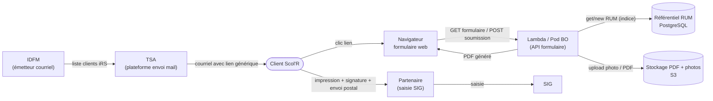

# Étude & macro-chiffrage – Formulaire hybride IRS Scol'R

Document d'étude préalable présentant deux scénarios cibles pour la mise en place d'un formulaire hybride permettant aux personnes éligibles de souscrire à l'abonnement **IRS Scol'R**. Le formulaire est dit « hybride » : le client le complète depuis son ordinateur, puis l'imprime pour la signature manuscrite, la photo et le RIB, avant envoi postal au partenaire pour saisie dans le SIG.

- **Auteur** : équipe FABRIQUE – Comutitres
- **Statut** : étude / macro-chiffrage
- **Échéance de retour** : 15 avril
- **Périmètre** : solutions 1 et 2 décrites dans les diagrammes de séquence

---

## 1. Contexte et objectif

### 1.1 Contexte métier

À la suite du point avec La Fabrique, Jean-Philippe a proposé deux options pour la gestion du formulaire hybride IRS Scol'R. L'équipe La Fabrique doit remonter une estimation de chiffrage.

- **Scénario 1** : génération de la RUM au moment de la génération du formulaire PDF pour impression.
  - TSA prend en charge l'envoi du mail aux clients Scol'R.
  - Un référentiel doit être créé pour assurer la génération de la RUM avec le numéro du formulaire.
- **Scénario 2** : génération de la RUM via un token présent dans le lien du formulaire envoyé par mail.
  - Comutitres doit envoyer le mail aux clients Scol'R (processus TSA → Comutitres à définir pour la transmission des adresses e‑mail).
  - Un référentiel RUM doit être créé ainsi qu'une génération de Token avec DataFactory.

### 1.2 Champs demandés au client pour la souscription

- Référence carte Scol'R
- Nom / prénom du payeur et du porteur
- Date de naissance
- Adresse e‑mail du payeur
- Adresse e‑mail du porteur
- Niveau scolaire
- Nom de l'établissement
- Adresse postale de l'établissement
- Photo du porteur
- N° de client du porteur (si déjà existant)
- N° de client du payeur (si déjà existant)
- Mandat SEPA et RUM
- RIB
- Signature (manuscrite après impression)

### 1.3 Règle de construction de la RUM

Le n° de RUM est formé de **33 ou 35 caractères** obtenus par concaténation de :

1. **Indicateur de continuité APA en Mandat** :
   - `++` si l'indicateur de mandat SEPA migré est à « Oui »
   - vide s'il s'agit de la création d'un nouveau mandat
2. **Code ICS Comutitres** : `FR42ZZZ457385`
3. **Référence du contrat** commercial ou tiers payant sur **14 caractères** :
   - remplacer les `_` éventuels par `-`
   - compléter à gauche par des `0` pour atteindre 14 caractères
4. **Code produit** sur **2 caractères** : `01` (iRS), `02` (iRE), `04` (NVA), `05` (NL+), complété à gauche par `0` si besoin
5. **Indice** sur **2 caractères** : distingue deux mandats sur un même contrat commercial ; commence à `00`, complété à gauche par `0`
6. **Clé de contrôle** sur **2 chiffres** : `97 – modulo97(chaîne_numérique)`
   - Les `++` sont remplacés par `11` pour le calcul
   - L'ICS n'est **pas** pris en compte
   - Les `_` dans la référence du contrat ne sont **pas** considérés

**Exemple** — Contrat Navigo Annuel référence `000987654_3` :
- RUM générée : `++FR42ZZZ457385000000987654-30400yy`
- Chaîne numérique pour le calcul de `yy` : `1100000098765430400`
- `yy = 97 – modulo97(1100000098765430400) = 97 – 69 = 28`
- RUM finale : `++FR42ZZZ457385000000987654-3040028`

---

## 2. Périmètre commun aux deux solutions

Quel que soit le scénario retenu, les composants suivants sont à livrer. Le chiffrage s'appuie sur une **forte réutilisation du socle SELFY existant** (NestJS, PostgreSQL, libs `logger` FE1382, `config`, `utils`, `auth`, `swagger`, `bootstrap`, pipelines CI/CD GitLab, déploiement Docker).

### 2.1 Formulaire web (front)

- Page publique (hors authentification BO) responsive, accessible via un lien spécifique.
- Validation front (champs obligatoires, formats, retour d'erreur instantané).
- Upload photo du porteur (format, poids, preview).
- Contrôle IBAN / BIC (modulo 97 IBAN).
- Accessibilité RGAA : **audit externe hors périmètre Build Fabrique** ; bonnes pratiques appliquées dans le code.
- Internationalisation : structure FR uniquement en V1.

### 2.2 Back-office / API (NestJS – socle SELFY)

- Endpoints d'affichage du formulaire (GET) et de soumission (POST).
- Endpoint de génération du PDF (template pré-rempli + photo + RUM).
- **Référentiel RUM** (PostgreSQL) – structure commune : `id`, `rum`, `indice`, `code_produit`, `ref_contrat`, `ics`, `cle_modulo97`, `indicateur_migration`, `client_ref`, `status`, `token` (scénario 2 uniquement), `created_at`, `used_at`.
- Implémentation de l'algorithme RUM (section 1.3) comme **service métier dédié** : transaction PostgreSQL, verrou logique sur l'indice, historique, tests unitaires exhaustifs, tests de concurrence.
- Contrainte d'unicité `(ref_contrat, code_produit, indice)` + verrou transactionnel.
- Stockage du formulaire soumis + horodatage + statut (brouillon / validé / PDF généré).
- Anti-abus : rate limiting, CAPTCHA, protection anti-replay.
- **PDF non modifiable** après génération (aplatissement des champs, pas d'interactivité résiduelle).
- Observabilité : logs au format **FE1382 via la lib `logger` SELFY** (Winston), corrélation `correlation_id` / `request_id`.

### 2.3 Génération PDF

- Template PDF avec zones pré-remplies + photo + RUM.
- Librairie à arbitrer (pdfkit, puppeteer). Hypothèse de chiffrage : **template fourni par le métier** ; sinon rallonger le lot PDF.
- Archivage du PDF (S3) avec URL signée à durée limitée.
- **Archivage légal mandats SEPA** à cadrer avec le DPO (durée de conservation réglementaire) — point listé, **mise en œuvre hors périmètre Build Fabrique**.

### 2.4 Socle transverse réutilisé depuis SELFY

- Documentation OpenAPI (lib `swagger` SELFY).
- Tests unitaires (l'algorithme RUM est critique) + intégration sur cas de concurrence.
- Observabilité (logs FE1382, métriques, alertes Datadog – cohérent avec le plan `docs/plan/plan-logging-unifie-tickets.md`).
- CI/CD (pipeline GitLab, Docker, déploiement cible) – patterns existants SELFY.

### 2.5 Éléments explicitement exclus du périmètre Build Fabrique

Ces items sont identifiés mais **non chiffrés** dans cette étude. Ils restent à porter par d'autres acteurs ou à chiffrer à part.

- Audit RGAA externe complet.
- DPIA RGPD et conformité (DPO).
- Recette métier IDFM / TSA (UAT élargie).
- Conduite du changement, formation utilisateurs.
- Support post go-live et MCO.
- Homologation sécurité transverse.
- Définition / négociation du processus d'échange inter-équipes (TSA → Comutitres en S2).
- Contractualisation Sarbacane (en S2).

---

## 3. Spécificités Solution 1 — Envoi mail par TSA, RUM à la génération PDF

### 3.1 Flux fonctionnel

1. IDFM envoie au client un courriel Tarif iRS (via TSA).
2. Le client clique sur le lien et le formulaire s'affiche.
3. Le client complète le formulaire — contrôle des champs obligatoires.
4. Au clic **« Télécharger PDF »** :
   - le BO interroge le référentiel RUM (nouvel indice pour le contrat),
   - génère la RUM,
   - produit le PDF,
   - retourne le PDF au client.
5. Le client imprime, signe, et envoie le formulaire papier par voie postale au partenaire.
6. Le partenaire réceptionne et saisit les informations dans le SIG.

### 3.2 Impacts techniques

- **Lien générique** : pas de personnalisation client → le formulaire est exposé publiquement, le client saisit lui-même sa référence carte Scol'R.
- **Sécurité accrue nécessaire** : sans lien personnalisé, CAPTCHA + validation forte de la référence carte contre un référentiel TSA obligatoires (sinon création de RUM orphelines possibles).
- **Dépendance TSA** : envoi mail géré côté TSA (aucun dev côté Comutitres sur cette brique).
- **Référentiel RUM** alimenté au runtime (à la volée), sans pré-génération.


### 3.3 Macro-chiffrage Solution 1

Unité : **jours-homme (j/h)**. Fourchette basse / haute par lot. Périmètre **Build Fabrique** (conception technique, dev, tests unitaires et d'intégration, QA technique, pilotage léger). Hors audit RGAA, DPIA, UAT métier, support post go-live.

| # | Lot | Détail | Charge |
|---:|---|---|---:|
| 1 | Cadrage technique & conception | specs techniques, modèle de données, stratégie RUM, ADR léger | 3 – 4 |
| 2 | Frontend formulaire | page, validations, upload photo, UX | 4 – 6 |
| 3 | Backend NestJS (endpoints + persistance) | GET/POST formulaire, persistance PostgreSQL, réutilisation libs SELFY (`config`, `utils`, `swagger`, `logger`) | 5 – 7 |
| 4 | Service RUM (algo + transaction + tests) | modulo 97, verrou Postgres, historique, tests unitaires + concurrence | 4 – 6 |
| 5 | Génération PDF | template, fusion données + photo + RUM, aplatissement | 3 – 5 |
| 6 | Sécurité minimale (CAPTCHA, rate-limit, anti-bot, contrôle réf. Scol'R) | protections formulaire public | 2 – 3 |
| 7 | QA technique & tests d'intégration | scénarios bout en bout Fabrique, cas de bord RUM, cas PDF | 3 – 5 |
| 8 | Pilotage & coordination | synchros, ajustements, support recette Fabrique | 2 – 3 |
| | **Total brut** |  | **26 – 39** |
| | **Marge 15 – 20 %** (incertitudes cadrage / intégration) |  | **+4 – +8** |
| | **Total macro retenu** |  | **30 – 47 j/h** |

**Hypothèses d'efficacité mobilisées** :
- réutilisation du socle SELFY (NestJS, logger FE1382, config, validators, swagger, CI/CD, Docker) ;
- volume cible ≤ 100 utilisateurs → pas d'infra dimensionnée ni de tests de charge lourds ;
- iRS uniquement en V1 → un seul code produit (`01`) à gérer dans l'algorithme RUM ;
- template PDF fourni par le métier.

---

## 4. Spécificités Solution 2 — Envoi mail par Comutitres via DataFactory + Sarbacane

### 4.1 Flux fonctionnel

1. IDFM envoie à **DataFactory** la liste des courriels clients Tarif iRS.
2. DataFactory :
   - récupère la liste des courriels client,
   - **génère la RUM par client** (pré-génération),
   - crée un **token** associé à la RUM,
   - construit la liste `courriel + lien + token`,
   - envoie la liste de diffusion à **Sarbacane**.
3. Sarbacane envoie les courriels individualisés au client (lien + token).
4. Le client clique sur le lien tokenisé → affichage du formulaire (RUM liée au token).
5. Le client complète, contrôle des champs obligatoires.
6. Génération PDF directe (la RUM est déjà connue, pas d'appel au référentiel au moment du téléchargement).
7. Le client imprime, signe, envoie le formulaire papier par voie postale.
8. Partenaire réceptionne et saisit dans le SIG.

### 4.2 Impacts techniques

- **DataFactory** : pipeline à industrialiser (job batch, ordonnancement, reprise sur erreur, idempotence). Outil existant côté Comutitres — **côté Fabrique, seule l'exposition de l'API RUM et le format d'échange sont chiffrés**.
- **Sarbacane** : routeur mail SaaS. Côté Fabrique, périmètre chiffré = intégration applicative de l'envoi de liste (API / export) ; **contractualisation et délivrabilité hors périmètre**.
- **Token** : recommandation **token opaque aléatoire** persisté en base PostgreSQL (expiration, usage unique, statut `active / used / revoked`). Choix plus sobre qu'un JWT pour un faible volume et un besoin simple ; évite de déporter trop d'information dans l'URL et simplifie la révocation.
- **Processus métier TSA → Comutitres** : à définir (fréquence, format d'échange SFTP / API, consentement RGPD) — **cadrage hors périmètre Fabrique**, seule l'interface technique d'ingestion est chiffrée.
- **Double référentiel** : table RUM + table token.
- **Sécurité renforcée** : lien personnalisé = risque en cas de divulgation → expiration obligatoire, non-réutilisation (anti-rejeu), protection brute-force.
- **UX** : pas de saisie manuelle de la référence carte Scol'R → parcours fluide, moins d'erreurs.

### 4.3 Macro-chiffrage Solution 2

Unité : **jours-homme (j/h)**. Fourchette basse / haute par lot. Périmètre **Build Fabrique**.

| # | Lot | Détail | Charge |
|---:|---|---|---:|
| 1 | Cadrage technique & conception | specs, modèle de données, stratégie RUM + token, interface DataFactory | 4 – 5 |
| 2 | Frontend formulaire | page, lecture / passage du token, validations, UX | 5 – 7 |
| 3 | Backend NestJS (endpoints + persistance + validation token) | GET/POST formulaire, consommation token, persistance PostgreSQL | 6 – 8 |
| 4 | Service RUM (algo + transaction + tests) | idem Solution 1 | 4 – 6 |
| 5 | Service Token (génération + stockage + expiration + consommation) | token opaque, table `form_access_token`, statuts | 3 – 5 |
| 6 | Génération PDF | template, fusion données + photo + RUM | 3 – 5 |
| 7 | Préparation campagne & intégration emailing | interface DataFactory / API RUM + API Sarbacane (envoi liste), mapping, gestion erreurs de lot | 5 – 8 |
| 8 | Sécurité & anti-rejeu | statuts token, contrôles anti-réutilisation, rate-limit, audit trail | 3 – 5 |
| 9 | QA technique & tests d'intégration | scénarios bout en bout, cas d'expiration, lien déjà utilisé, régénération, cas de bord RUM | 4 – 6 |
| 10 | Pilotage & coordination | synchros, coordination inter-équipes Fabrique (Sarbacane / DataFactory), support recette | 3 – 4 |
| | **Total brut** |  | **40 – 59** |
| | **Marge 15 – 20 %** (incertitudes cadrage / intégration) |  | **+6 – +12** |
| | **Total macro retenu** |  | **46 – 71 j/h** |

**Hypothèses d'efficacité mobilisées** :
- mêmes hypothèses que Solution 1 (socle SELFY, volume ≤ 100, iRS seul, template PDF fourni) ;
- DataFactory et Sarbacane existent déjà côté Comutitres : seul le **contrat d'interface** (API / formats) est chiffré côté Fabrique ;
- gouvernance inter-équipes (TSA → Comutitres) et contractualisation Sarbacane : **hors périmètre Fabrique**.

---

## 5. Synthèse comparative

| Critère | Solution 1 | Solution 2 |
|---|---|---|
| Complexité technique globale | Faible à modérée | Modérée à forte (DataFactory + Sarbacane + tokens) |
| Nouveaux composants | Référentiel RUM | Référentiel RUM + tokens + interface DataFactory + intégration Sarbacane |
| Charge macro Build Fabrique | **30 – 47 j/h** | **46 – 71 j/h** |
| Coût de run | Faible | Modéré (pipeline batch + emailing à maintenir) |
| Expérience utilisateur | Moyenne (saisie réf. carte par le client) | Meilleure (lien personnalisé, pré-remplissage possible) |
| Sécurité d'accès | Exposition publique → CAPTCHA + contrôle réf. carte | Lien personnalisé + token à durée limitée |
| Traçabilité | Moyenne | Forte (token nominatif + audit trail) |
| Dépendances externes | TSA (envoi mail) | TSA (liste mail) + Sarbacane + DataFactory |
| Dépendances processus | Faibles | Fortes (nouveau processus TSA → Comutitres) |
| Adaptation ≤ 100 utilisateurs | Très bonne | Bonne (surdimensionnée si volume reste faible) |
| Scalabilité future | Moyenne | Meilleure (industrialisation campagne) |
| Risque projet | Modéré | Plus élevé (intégrations multiples) |

---

## 6. Risques et points de vigilance

### 6.1 Communs

- **Algorithme RUM** : une erreur de calcul modulo 97 entraîne un rejet par l'ACE → batterie de tests dédiée (cas `_` dans la référence, cas `++` migration SEPA, cas `00` à `99` d'indice). En V1 iRS seul, le périmètre de test est réduit (code produit `01`).
- **Unicité de l'indice** par contrat commercial : verrou transactionnel + contrainte `UNIQUE(ref_contrat, code_produit, indice)`.
- **Photo porteur** : format, taille max, stockage S3, contrôle anti-malware.
- **PDF non modifiable** après génération (aplatissement des champs) pour éviter toute falsification avant signature.
- **Réversibilité si rejet ACE** : procédure d'annulation / régénération de RUM à prévoir en exploitation (runbook).
- **Archivage légal mandats SEPA** : durée de conservation à cadrer avec le DPO (hors périmètre Fabrique mais bloquant en prod).
- Ambiguïtés métier à lever avant build : gestion de la photo (en ligne / papier / les deux), gestion du RIB, modèle exact du PDF cible.

### 6.2 Solution 1

- Saisie de la référence carte Scol'R par le client → risque de **création de RUM orphelines** si pas de contrôle strict contre un référentiel TSA. **Bloquant** si TSA ne fournit pas d'API de vérification.
- Formulaire public : risque bot / spam → CAPTCHA (reCAPTCHA v3 ou hCaptcha) + rate-limit.
- **RUM consommée à tort** si le client génère le PDF mais n'envoie jamais le dossier papier. Comportement à assumer et documenter.
- Lien faiblement personnalisé : traçabilité plus faible sur l'origine du formulaire.

### 6.3 Solution 2

- **DataFactory** : outil interne Comutitres ; validation de la disponibilité et du format d'échange.
- **Sarbacane** : contractualisation, quota, délivrabilité (SPF / DKIM / DMARC) — **hors périmètre Fabrique**.
- **Token** : choix token opaque vs JWT. En contexte faible volume + besoin de révocation simple, **recommandation token opaque** persisté en base (cf. §4.2).
- **Anti-rejeu** : un même lien ne doit pas permettre la régénération de plusieurs formulaires signables sans contrôle.
- **Sensibilité à la qualité des listes reçues** : une anomalie sur la préparation de campagne peut bloquer l'envoi global.
- **Processus TSA → Comutitres** : chantier fonctionnel à part pouvant retarder la mise en route.

---

## 7. Hypothèses de chiffrage

Les hypothèses suivantes cadrent le macro-chiffrage. Toute remise en cause implique un re-chiffrage.

1. **Volume cible ≤ 100 utilisateurs** en V1 → pas d'infra dimensionnée pour montée en charge, pas de tests de performance lourds, PostgreSQL mutualisé.
2. **Cible V1 restreinte au produit iRS** (code produit `01`) → un seul cas à implémenter dans l'algorithme RUM.
3. **Forte réutilisation du socle SELFY** : NestJS, PostgreSQL, libs `logger` (FE1382 / Winston), `config`, `utils`, `auth`, `swagger`, `bootstrap`, pipelines CI/CD GitLab, Docker, Datadog, patterns CQRS / DDD.
4. **Chiffrage Build Fabrique strict** : conception technique, développement, tests unitaires et d'intégration, QA technique, pilotage léger.
5. **Explicitement exclus** : audit RGAA externe, DPIA RGPD, recette métier IDFM / TSA, homologation sécurité transverse, conduite du changement, formation utilisateurs, support post go-live, contractualisation Sarbacane, cadrage du processus TSA → Comutitres.
6. Template PDF fourni par le métier.
7. Signature numérique hors scope V1 (signature papier après impression).
8. Pas de paiement en ligne dans le scope (RIB collecté, prélèvement géré en aval).
9. 1 j/h = 7 h productives. Marge de **15 – 20 %** intégrée dans les totaux pour absorber l'incertitude amont.
10. Environnements cibles : dev, recette, prod.
11. Pas de reprise de données historiques (démarrage à blanc).
12. Le macro-chiffrage n'est pas un engagement forfaitaire détaillé ; il pourra évoluer à l'issue d'un atelier de cadrage détaillé et d'un spike technique RUM.

---

## 8. Éléments de décision pour le comité de pilotage

**Le choix entre Solution 1 et Solution 2 relève du comité de pilotage.** Cette section fournit les critères de décision sans trancher.

### 8.1 Critères pouvant orienter vers la Solution 1

- Priorité donnée à la **rapidité de mise en œuvre** et à la **maîtrise de la charge**.
- **Volume faible confirmé** (≤ 100 utilisateurs) et absence de prévision de forte croissance à court terme.
- Acceptation de la saisie de la référence carte Scol'R par le client, sous réserve d'un contrôle serveur (API TSA).
- Envoi mail déjà pris en charge par TSA, sans besoin de reprise côté Comutitres.
- Acceptation du comportement « RUM consommée même en cas d'abandon après génération PDF ».

### 8.2 Critères pouvant orienter vers la Solution 2

- Exigence de **sécurisation nominative** de l'accès au formulaire (lien personnalisé, token expirant).
- Besoin de **pré-remplissage** et d'une UX plus fluide (réduction des erreurs de saisie).
- Besoin de **traçabilité forte** des campagnes (qui a reçu, qui a cliqué, qui a soumis).
- Volonté d'**industrialiser** le dispositif pour d'autres produits (iRE, NVA, NL+) ou d'autres campagnes ultérieures.
- DataFactory et Sarbacane déjà opérationnels et accessibles côté Comutitres, processus TSA → Comutitres déjà cadré ou en cours de cadrage.

### 8.3 Charges et délais à retenir

| | Solution 1 | Solution 2 |
|---|---|---|
| Charge macro Build Fabrique | **30 – 47 j/h** | **46 – 71 j/h** |
| Delta charge S2 – S1 | — | **+ ~ 16 – 24 j/h** |
| Complexité d'intégration | Faible | Modérée à forte |
| Time-to-market estimé (squad 3 – 4 pers.) | ~ 3 – 4 semaines | ~ 5 – 7 semaines |

### 8.4 Recommandation d'architecture commune aux deux scénarios

Quel que soit le choix du comité, il est recommandé de concevoir dès la V1 :

- un **service RUM isolé** (module NestJS dédié, testé unitairement) ;
- un **module de génération PDF isolé** ;
- un **schéma PostgreSQL extensible** (prévoir le champ `token` et la table `form_access_token` même non utilisés en Solution 1) ;
- une **traçabilité exploitable** (logs FE1382, audit trail).

Ce découpage permet une évolution ultérieure de la Solution 1 vers la Solution 2 sans refonte majeure.

---

## 9. Prochaines étapes

1. Atelier de cadrage fonctionnel (PO + Archi + TSA + IDFM) : valider la liste des champs, règles de gestion RUM produit iRS, processus postal, modèle PDF cible.
2. Spike technique RUM (1 – 2 j/h) : implémenter et tester l'algorithme modulo 97 sur les exemples fournis pour sécuriser le chiffrage back.
3. Validation de la disponibilité d'une API TSA pour le contrôle de la référence carte Scol'R (prérequis bloquant Solution 1).
4. Si Solution 2 envisagée : validation accès DataFactory + contractualisation Sarbacane + cadrage du processus TSA → Comutitres (hors périmètre Fabrique mais bloquant).
5. ADR tranchant : stack PDF, stack token, hébergement de la page publique.
6. Lancement DPIA RGPD en parallèle (hors périmètre Fabrique).
7. Affinage du chiffrage en user-stories Jira une fois la solution retenue par le comité.

---

## 10. Fiche d'architecture cible — Solution 1

### 10.1 Vue composants



### 10.2 Briques cibles

| Brique | Rôle | Techno cible |
|---|---|---|
| Front formulaire | Page publique responsive, validations, upload photo | Angular / Vue / React (à arbitrer selon stack front Comutitres) |
| API BO | Exposition endpoints formulaire + PDF, orchestration RUM | NestJS (aligné avec SELFY) ou Lambda Node selon hébergement cible |
| Référentiel RUM | Source de vérité des RUM et de leurs indices | PostgreSQL + migrations gérées par le service |
| Algorithme RUM | Calcul concaténation + clé modulo 97 | Module TypeScript isolé, testé unitairement |
| Générateur PDF | Rendu du formulaire pré-rempli + photo + RUM | Puppeteer (HTML → PDF) ou pdfkit |
| Stockage objet | Photos + PDFs archivés, URL signée | AWS S3 + IAM policy restrictive |
| CAPTCHA | Protection anti-bot du formulaire public | reCAPTCHA v3 ou hCaptcha |
| Contrôle réf. Scol'R | Validation de la référence carte saisie | API TSA (à confirmer) ou référentiel importé |
| Observabilité | Logs FE1382, métriques, alertes | Winston + Datadog (plan logging SELFY) |
| CI/CD | Build, test, déploiement | GitLab CI + Docker |

### 10.3 Flux de données clés

- **Création d'une RUM** : transaction BDD avec verrou sur `(ref_contrat, code_produit)` pour obtenir l'indice suivant, insertion + calcul de la clé modulo 97, retour de la RUM formatée.
- **Soumission du formulaire** : validation serveur, stockage chiffré des champs sensibles (RIB, e‑mail), photo stockée sur S3, statut `draft → submitted → pdf_generated`.
- **Génération PDF** : lecture du formulaire + RUM, fusion dans le template, archivage S3, URL signée à courte durée (ex. 15 min).

### 10.4 Modèle de données (extrait)

```
Table rum
- id (PK)
- rum (unique)
- ref_contrat (14)
- code_produit (2)
- indice (2)
- cle_modulo97 (2)
- indicateur_migration (bool)
- client_ref (nullable)
- status (enum: reserved, used, cancelled)
- created_at, used_at

Table formulaire_soumission
- id (PK)
- rum_id (FK -> rum.id, nullable avant génération PDF)
- carte_scolr_ref, payeur_nom, payeur_prenom, payeur_email,
  porteur_nom, porteur_prenom, porteur_date_naissance, porteur_email,
  niveau_scolaire, etablissement_nom, etablissement_adresse,
  client_porteur_num (nullable), client_payeur_num (nullable),
  rib_iban, rib_bic, photo_s3_key, pdf_s3_key,
  status (enum), created_at, updated_at
```

### 10.5 Sécurité

- Endpoints publics protégés par CAPTCHA + rate-limit IP.
- Contrôle serveur de la référence carte Scol'R avant création de la RUM.
- Chiffrement au repos : S3 SSE-KMS ; PostgreSQL chiffrement TDE.
- Chiffrement applicatif des champs RIB (AES-GCM) avec KMS.
- Journalisation FE1382 sans exposition de secrets (masquage IBAN, e‑mail partiel).
- Headers HTTP : HSTS, CSP stricte, X-Frame-Options, X-Content-Type-Options.

### 10.6 Observabilité & RUN

- Logs applicatifs Winston au format FE1382 (cf. `docs/plan/plan-logging-unifie-tickets.md`).
- Métriques clés : taux de soumission, taux de PDF généré, taux d'erreur RUM (clé invalide), latence PDF, erreurs CAPTCHA.
- Alertes Datadog : 5xx > seuil, échec RUM > seuil, latence PDF p95.
- Runbook MCO : ré-émission PDF, invalidation RUM, audit RUM.

### 10.7 Déploiement cible

- Environnements : dev, recette, prod.
- Packaging Docker, pipeline GitLab CI, déploiement Kubernetes (cohérent SELFY) ou Lambda selon arbitrage infra.
- Secrets gérés via AWS Secrets Manager.

